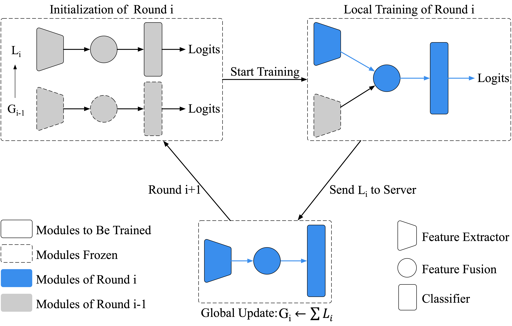

# Towards Faster and Better Federated Learning: A Feature Fusion Approach

The implementation of "Towards Faster and Better Federated Learning: A Feature Fusion Approach" (ICIP 2019).\
[[PDF]](https://yaox12.github.io/assets/files/yao2019federated.pdf) (The full version on [arXiv](https://arxiv.org/abs/1908.05891))

## Introduction

Federated learning enables on-device training over distributed networks consisting of a massive amount of modern smart devices, such as smartphones and IoT devices.
However, the leading optimization algorithm in such settings, i.e., *federated averaging*, suffers from heavy communication cost and inevitable performance drop, especially when the local data is distributed in a Non-IID way.

In this paper, we propose a feature fusion method to address this problem.
By aggregating the features from both the local and global models, we achieve a higher accuracy at less communication cost.
Furthermore, the feature fusion modules offer better initialization for newly incoming clients and thus speed up the process of convergence.
Experiments in popular federated learning scenarios show that our federated learning algorithm with feature fusion mechanism outperforms baselines in both accuracy and generalization ability while reducing the number of communication rounds by more than 60%.



## Cite

If you find this work useful to you, please cite the full version ([arXiv](https://arxiv.org/abs/1908.05891)):
```
@article{yao2019federated,
  Author = {Yao, Xin and Huang, Tianchi and Wu, Chenglei and Zhang, Rui-Xiao and Sun, Lifeng},
  Journal = {arXiv preprint arXiv:1908.05891},
  Title = {Federated Learning with Additional Mechanisms on Clients to Reduce Communication Costs},
  Year = {2019}
}
```
